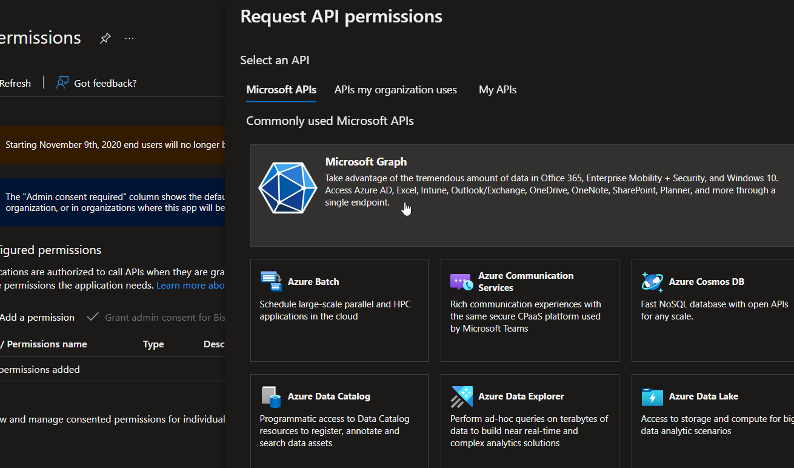
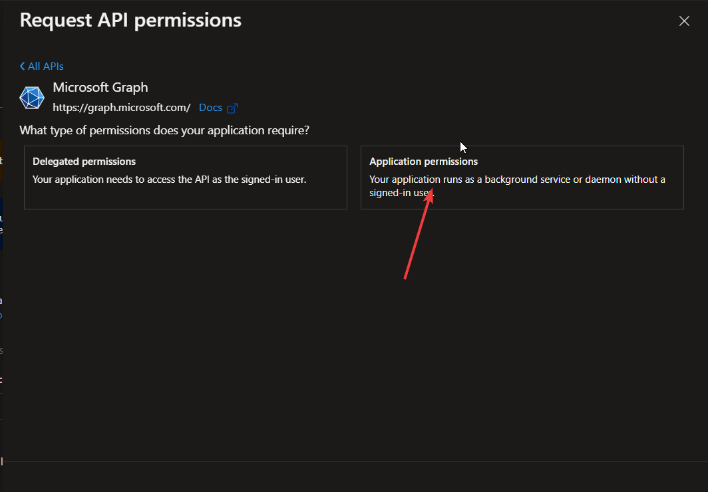
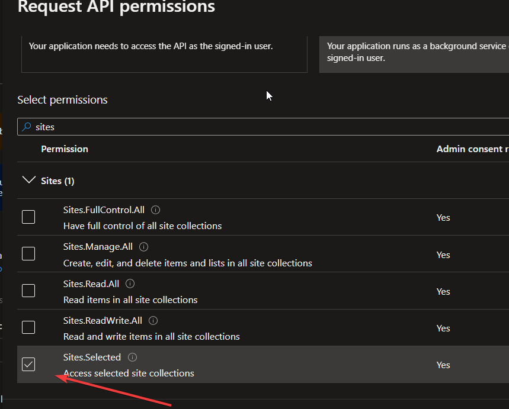

# Copiar ficheros de Sharepoint mediante Datafactory


## Introducción

El objetivo de nuestro pipeline es crear un flujo para copiar ficheros entre Sharepoint y cualquier otro destino mediante un service principal que solo tenga permisos para acceder a ese Site y no a todo el sharepoint coorporativo 


## Requerimientos principales:

Es necesario usar la api Graph que prové Microsoft para limitar el permiso a solo un site. Para obtener un usuario de aplicación con acceso a Sharepoint existen dos métodos:

(a)	Mediante un sistema llamado “app-only” mediante un Sharepoint app-only principal. 
(b)	Mediante la api graph y un service principal creado en el AAD del cliente. 

Aquí vamos a tratar la 2a opción que nos permite definir permisos a nivel de sitio. Además la opción 1 depende en parte de un servicio que fue retirado en noviembre de 2018 y aunque Microsoft asegura que aún puede funcionar, preferimos la opción más “moderna”


Requerimientos iniciales
En el lado del cliente, para gestionar permisos en el tenant del cliente necesitamos:
•	Que un usuario con permisos tenga capacidad para ejecutar powershell con su usuario de AAD. 
•	Que el usuario cree un service principal dentro de su Azure Active Directory

###	Creación del service principal

Se debe crear primero un Service Principal, es decir, un usuario de aplicación, el cual tendrá permisos limitados a sharepoint:

https://portal.azure.com/#view/Microsoft_AAD_RegisteredApps/ApplicationsListBlade

y hacemos click en “new registration” para crear un nuevo service principal:

  
 
En el nombre poner algo como: **sepr-sharepoint-NOMBRE_SITE**:

  

Y registrar sin modificar ninguna otra opción y obtenemos el App_id 

Acceder al menú “Api permissions” y añadir el permisos de sharepoint sites.Selected


  
 

  
 


En esta pantalla vamos a seleccionar Application Permisssions:
 

   

Y seleccionamos solamente “Sites.Selected” permissions:

  
 

Finalmente, un usuario con permisos de administrador de Azure debe “consentir” esta petición de permisos:

  

Ahora debemos dar permisos a este service principal solamente para acceder a sharepoint. 


### Proveer de permisos al service principal creado

Para dar permisos al service principal debemos o bien usar powershell o bien la API graph pero para ello deberíamos primero obtener un access token, por lo que vamos por la opción de **Powershell**:

1. Instalamos el módulo de Powershell para Sharepoint:
```powershell
Install-Module -Name PnP.PowerShell -Scope CurrentUser
```
Logarnos con un usuario con permisos de admin:
```powershell
Connect-PnPOnline $targetSiteUri -Interactive
```

Y ejecutar la siguiente linia con estas variables:

- **$clientId**: Id del service principal al que le damos permiso
- **$targetSiteUri**: Url del site al que queremos dar permisos, como https://bismart.sharepoint.com/my_site

```powershell
Grant-PnPAzureADAppSitePermission -AppId $clientId -DisplayName 'ShareSite' -Site $targetSiteUri -Permissions Write,Read
```

### Acceder a la API de api graph

El siguiente paso es identificar los recuros que queremos copiar dentro de Sharepoint mediante la API graph:

1. Login con service principal:
```
POST https://login.microsoftonline.com/[TENANT_ID]/oauth2/v2.0/token 
Headers: Content-Type: application/x-www-form-urlencoded
Fields:
- client_id: es el app_id que hemos creado
- client_secret: secret creado junto en app_id en el primer paso
- scope: https://graph.microsoft.com/.default
- grant_Type: client_credentials
```

Esta llamada nos devuelve un Access_token, con 1h de duración con el que haremos las siguientes peticiones:

Como nuestro usuario tiene acceso limitado a sharepoint, necesitamos saber de antemano el ID de site al que podemos acceder. Para identificar este ID, lo más sencillo es dirigirnos a esta url:

https://NOMBRECOMPAÑIA.sharepoint.com/sites/NOMBRE_SITIO/_api/site/id
Debemos quedarnos con el valor de Edm.Guid


Otra manera es mediante powershell:

```
$site = Get-PnPSite -Includes ID
write-host $site.Id
```

O en el caso de tener subsites, podemos llamar a un comando para obtener la lista de subsites:

```
Get-PnPSubWeb
```

Finalmente, con POSTMAN podemos simular el caminio que luego vamos a exportar a Datafactory:

Con postman, primero necesitamos obtener el access_token:


**Obtener listado de librerías dentro de nuestro site:**

https://graph.microsoft.com/v1.0/sites/SITE_ID

Esto nos devuelve la lista de librerías o drives dentro el site. Debemos quedarnos con el ID del documentLibrary que nos interesa:

 

En este caso nos quedmos con el ID del drive llamado “share” y librería “Documentos Compartidos”

1.5	Descargar un fichero
https://graph.microsoft.com/v1.0/sites/SITE_ID/drives/DRIVE_ID/root:/NOMBRE_CARPETA/NOMRE_FICHERO:/content

1.6	Subsites
 
Hay casos en los que los documentos están en subsites y estos subsites en algunos casos no nos aparecen al listar desde la AP de graph.

Para llegar a un subsite, la API debería ser:

https://graph.microsoft.com/v1.0/sites/SITE_ID/sites

Si no aparece el siteId del subsite que buscamos, podemos usar powershell para listar los subsites:

Get-PnPSubWeb

Esta orden nos devuelva la lista de subsites y los Id’s asociados. 

Con ese ID, podemos ver los documentos en el subsite:

https://graph.microsoft.com/v1.0/sites/SITE_ID/sites/SUBSITE_ID

y actuar de igual manera buscando los drives, carpetas y ficheros descrito más arriba. 


